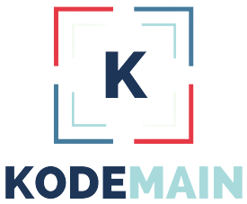

<p align="center">
  <a href="https://github.com/criscue93" target="blank"></a>
</p>

<p align="center"></p><p align="center">
<a href="https://www.npmjs.com/~nestjscore" target="_blank"></a>
<a href="https://www.npmjs.com/~nestjscore" target="_blank"></a>
<a href="https://www.npmjs.com/~nestjscore" target="_blank"></a>

## Description

Microservice for sending messages by whatsapp

## Installation

```bash
$ npm install
```

## .ENV

In the .env.example file are the environment variables to be used to run the project.

## Running the app

```bash
# development
$ npm run start

# watch mode
$ npm run start:dev

# production mode
$ npm run start:prod
```

## Stay in touch

- Author - Ing. Cristian Cueto V.
- Developer - Ing. Cristian Cueto V.

## License

WHATSAPP-API [MIT licensed](LICENSE).
